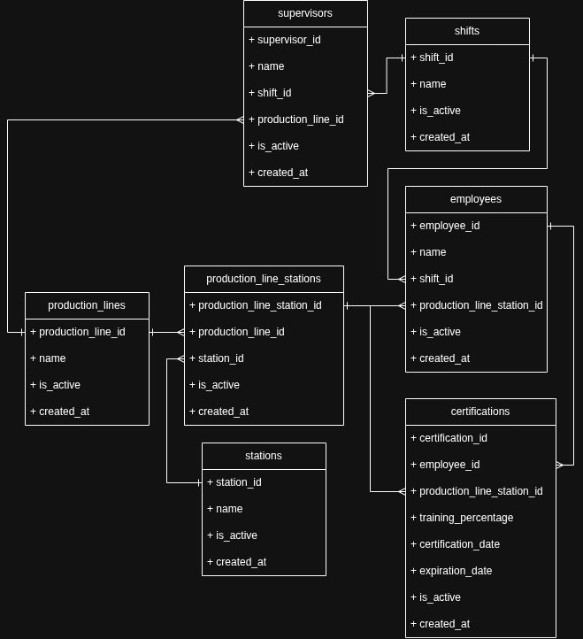
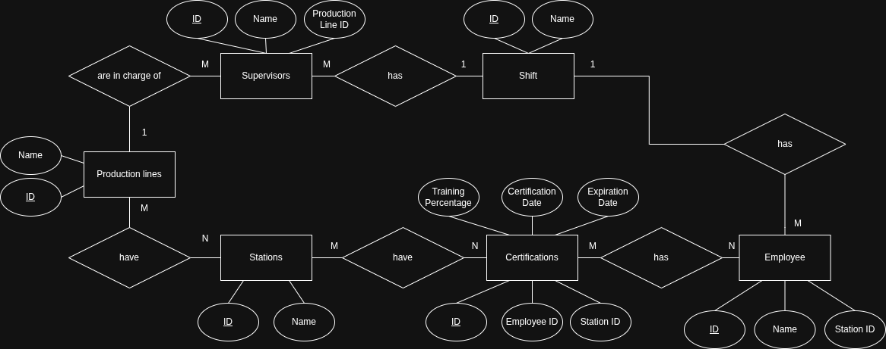

# CertifiedStaff

Sistema web desarrollado en **ASP.NET Core Razor Pages** para la gestión de certificaciones de personal en líneas de producción.  
Permite filtrar, visualizar y exportar información de certificaciones clasificadas por estado.

---

## 🚀 Características

- 🔎 Filtros por:
  - Production Line
  - Station
  - Supervisor

- 📊 Clasificación automática de certificaciones:
  - Ongoing (En proceso)
  - Completed (Completadas)
  - Expired (Expiradas)

- 📄 Paginación independiente por cada sección

- 📤 Exportación a Excel (.xlsx):
  - Hoja de Ongoing Certificates
  - Hoja de Completed Certificates
  - Hoja de Expired Certificates

- ⚡ Consultas optimizadas con Entity Framework Core

---

## 🧱 Tecnologías

- ASP.NET Core 10 (Razor Pages)
- Entity Framework Core
- SQL Server
- ClosedXML (exportación a Excel)
- Bootstrap 5

---

  <h2>Diagrama de clases</h2>
  

  <h2>Diagrama ER</h2>
  

    <h2>🚀 Instalación y ejecución</h2>
    <h3>1. Clonar el repositorio</h3>
    <ul>
        <li>Clona el proyecto desde GitHub en tu máquina local</li>
    </ul>
    <pre><code>git clone https://github.com/CarlosGal19/CertifiedStaffPractice.git
cd CertifiedStaffPractice</code></pre>
    <h3>2. Restaurar dependencias</h3>
    <ul>
        <li>Descarga todos los paquetes necesarios de NuGet</li>
    </ul>
    <pre><code>dotnet restore</code></pre>
    <h3>3. Configurar cadena de conexión</h3>
    <ul>
        <li>Edita el archivo <b>appsettings.Development.json</b></li>
        <li>Actualiza la cadena de conexión a tu base de datos</li>
    </ul>
    <pre><code>{
  "ConnectionStrings": {
    "DefaultConnection": "Server=localhost;Database=CertifiedStaffDB;User Id=sa;Password=tu_password;TrustServerCertificate=True;"
  }
}</code></pre>
    <h3>4. Ejecutar migraciones</h3>
    <ul>
        <li>Crea la estructura de la base de datos en SQL Server</li>
    </ul>
    <pre><code>dotnet ef database update</code></pre>
    <h3>5. Ejecutar el proyecto</h3>
    <ul>
        <li>Inicia el servidor de ASP.NET Core</li>
    </ul>
    <pre><code>dotnet run</code></pre>
    <h3>6. Seed de base de datos</h3>
    <ul>
        <li>El seed se ejecuta automáticamente al iniciar el sistema</li>
        <li>No requiere pasos manuales</li>
    </ul>
    <h3>⚙️ Requisitos</h3>
    <ul>
        <li>.NET 10 SDK</li>
        <li>SQL Server</li>
        <li>Entity Framework Core Tools</li>
    </ul>
    <pre><code>dotnet tool install --global dotnet-ef</code></pre>

